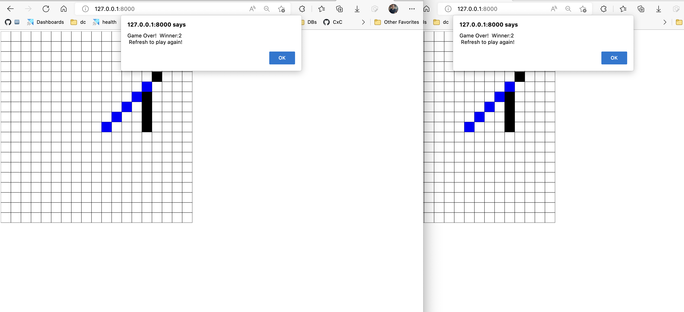

# five-in-a-row

A simple "Five in a Row" game implemented with pure Javascript, HTML5 Canvas, and a flask web server.  The clients communicate over Web Sockets.

## Starting the game

### Start Client Server

In one terminal, run a simple HTTP server in the `client` directory.  This can easily be done with python.

```bash
cd client
python -m http.server
```

### Start Flask Server

In another terminal, run the flask server.

```bash
cd server
flask run --reload
```

### Playing

To play, open `http://localhost:8000/` twice in two browser tabs.  The first player to join will be player 1, and the second player to join will be player 2.  The game will start when both players have joined.

